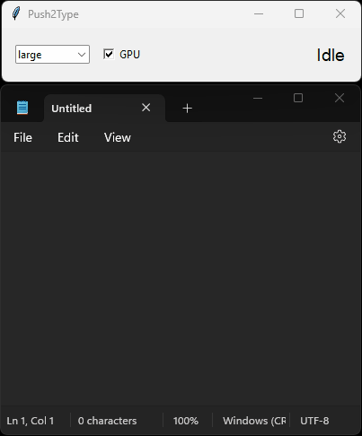

# Push2Type: Real-Time Speech-to-Text Transcription Utility

Push2Type is a straightforward utility for **LOCAL** speech-to-text transcription. Built on OpenAI's Whisper and powered by a simple Tkinter GUI, it's designed for developers and PC power users who need reliable, live transcription without the fluff.



## What It Does

- **Real-Time Transcription:**  
  Capture your microphone input and convert speech to text on the fly.
  
- **Multiple Models:**  
  Choose between various Whisper model variants (e.g., `base`, `small.en`) so you can adjust for speed or accuracy.
  
- **Push-to-Talk Mode:**  
  Control recording with a hotkey—press to record, release to transcribe. (Hold `Ctrl+Win` by default)
  
- **Simple UI:**  
  A minimal, functional interface that keeps things clear and straightforward.
  
- **Easy Packaging:**  
  Use PyInstaller to build a standalone executable if you need to distribute your own version.

## How It Works

Push2Type listens to your mic when you hold the push-to-talk hotkey (`Ctrl+Win` by default). It captures the audio, processes it, and sends it through a Whisper model for transcription upon release of the hotkey. The transcribed text is then injected into the currently active field of your target application via simulated clipboard paste action (no keystroke simulation).

## Getting Started

### Requirements

- **Python 3.8+ (Developed and tested with Python 3.13)**
- **A working microphone**
- **Optional:** A CUDA-compatible GPU for faster processing if desired (set in `config.py`). If CUDA is not found, the application will default to CPU.

### Quick Setup on Windows

1. **Create a Virtual Environment:**

   In your project directory, run:
   ```bash
   python -m venv venv
   venv\Scripts\activate
   ```

2. **Install Dependencies:**

   With your virtual environment activated, run:
   ```bash
   pip install -r requirements.txt
   ```

3. **Configure:**

   Edit `push2type_config.json` after first run to customize settings.

4. **Run Push2Type:**

   Launch the application by running:
   ```bash
   python main.py
   ```
   The GUI will open immediately, and you can use your configured hotkey (default: `Ctrl+Win`) to start transcribing.


## Packaging Your Application

If you want to build a standalone executable:

1. **Build It:**
   ```bash
   python -m PyInstaller build.spec
   ```
   The packaged app will be available in the `dist/` directory.

## Contributing

Contributions, bug reports, and suggestions are welcome. If you have ideas for improvements or fixes, feel free to fork the repository and submit a pull request. I am all about keeping it simple and useful.

## License

This project is licensed under the MIT License - see the [LICENSE](LICENSE) file for details.

---

Thanks for checking out Push2Type. If you're a developer or power user looking for a reliable, real-time speech-to-text tool without the hype, give it a try! 